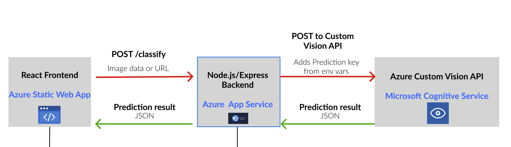

# Tina Bot's Car Classifier

This project is a full-stack cloud application that lets the user classify car images using Azure Custom Vision.
It consists of a React frontend and a Node.js/Express backend.

**🖥️ [View the live app here](https://icy-glacier-0bd51fe10.2.azurestaticapps.net)**

---

## Features

- Upload a car image or provide an image URL
- Get car classification results by Azure Custom Vision
- Secure backend proxy to keep API keys safe
- Deploys to Azure Static Web Apps (frontend) and Azure App Services (backend)

---

## How it Works

1. **Frontend (React + Vite):**
   - User uploads an image or enters image URL.
   - The app sends a POST request to the backend `/classify` endpoint.
2. **Backend (Node.js/Express):**
   - Receives the image or URL.
   - Forwards it to Azure Custom Vision API using a secure Prediction Key (stored in environment variables).
   - Returns the prediction result to the frontend.
3. **Frontend:**
   - Displays the classification result to the user.

> **Note:** The backend (Node.js/Express) is maintained in a separate repository.  
> [Mission 01 Backend repository](https://github.com/AndyGuffey/mission01-backend)

#### Project Architecture Diagram

> 

---

## Project Structure

```
mission-01/                # Frontend repo (this repo)
  ├── src/                # React frontend source code
  ├── .env.example        # Example environment variables for frontend
  ├── package.json        # Frontend dependencies and scripts
  └── ...

mission01-backend/         # (separate repo)
  ├── index.js            # Node.js/Express backend code
  ├── .env.example        # Example environment variables for backend
  ├── package.json        # Backend dependencies and scripts
  └── ...

Azure Custom Vision Resource  # (external cloud resource)
  ├── Prediction Endpoint     # Used by backend for classification
  └── Prediction Key          # Stored securely in backend environment variables
```

---

## Getting Started

### 1. Clone frontend Repo

```sh
git clone https://github.com/AndyGuffey/mission01-turners-ai-car-classifier
cd mission-01
```

### 2. Set up environment variables

- Copy `.env.example` to `.env` and set `VITE_BACKEND_URL` to your backend endpoint (local or cloud).

### 3. Install frontend dependencies

```sh
npm install
```

### 4. Start the frontend

```sh
npm run dev
```

### 5. Set up and run the backend

- Clone the backend repository:  
  `git clone https://github.com/AndyGuffey/mission01-backend.git`
- Follow the backend repo's README for setup and running instructions.

---

## Deployment

- **Frontend:** Deploy to Azure Static Web Apps. Set `VITE_BACKEND_URL` in Azure App Settings for production.
- **Backend:** Deploy to Azure App Service. Set Azure Custom Vision keys in App Service Configuration.

> **Note:**  
> To run the backend, you will need your own Azure Custom Vision **Prediction Endpoint** and **Prediction Key**.  
> These must be set as environment variables in your backend's `.env` file or in your Azure App Service configuration.

---

## Credits

- Built with [React](https://react.dev/), [Vite](https://vitejs.dev/), [Express](https://expressjs.com/), and [Azure Custom Vision](https://azure.microsoft.com/en-us/products/cognitive-services/custom-vision-service/).

> **This is my second project of the Level 5 Advanced Full Stack Developer course with Mission Ready.**
